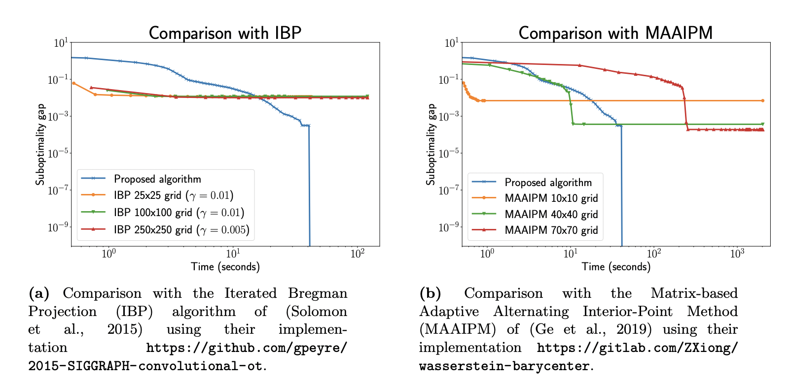
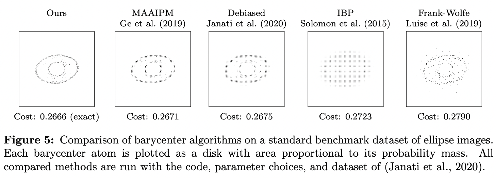

# Computing free-support Wasserstein Barycenters exactly

This repository contains the code from [Altschuler, Boix-Adsera JMLR 2021](https://jmlr.org/papers/v22/20-588.html) for computing exact Wasserstein barycenters between discrete distributions.

⚠️ **WARNING: This is academic code** ⚠️
* Our focus in writing this code was clarity over speed, and we believe that further optimization can be done. This means that our implementation can be quite slow. (On medium-size inputs, our program can be ~1000 times slower, if not more, compared to **approximate** barycenter solvers.)
* However, our implementation still returns an **exact** barycenter much faster than previous "brute-force" methods, and scales to much larger problem sizes than previously possible.
* We believe that it is an interesting research direction to create practical, **exact** barycenter solver implementations that compete in runtime with **approximate** solvers and are practical to use on medium-size and large-size inputs.
* We have only implemented our algorithm for 2-dimensional distributions (e.g., images), because this allows us to use existing geometry packages.

## Installation

This installation allows you to run our barycenter-computation code in your applications.

1. Download the code or clone the Github repository with
```
git clone https://github.com/eboix/high_precision_barycenters.git
```

2. Using the [Anaconda](https://docs.anaconda.com/anaconda/install/) package manager, run:

```
conda install -c conda-forge matplotlib
conda install -c conda-forge scikit-learn
conda install -c conda-forge scikit-geometry
```

3. Install [PuLP](https://github.com/coin-or/pulp):
`python -m pip install pulp`


4. `example_barycenter_computation.py` provides example usage of our code.


#### Troubleshooting
If the `scikit-geometry` installation fails, we recommend to install from source. For this, first install the CGAL library:
```
conda install -c conda-forge cgal-cpp
```
Then clone scikit-geometry:
```
git clone https://github.com/scikit-geometry/scikit-geometry
```
And finally, in the `scikit-geometry` folder, run
```
python -m pip install -e . -v
```
This final step may take some time.


## Reproducing comparisons

Our JMLR paper has 2 comparisons against state-of-the-art methods:

- Figure 3 shows that our algorithm can compute exact barycenters at previously intractable sizes. To reproduce this, go to the folder `jmlr_figure3` and follow the instructions in [`jmlr_figure3/README.md`](jmlr_figure3)


- Figure 5 shows that the high-precision barycenters computed by our algorithm yield sharper visualizations. This is demonstrated on a standard benchmark dataset of images of concentric ellipses. The raw images to be averaged, barycenter images produced by state-of-the-art algorithms, and the barycenter image produced by our algorithm can be found in the folder `jmlr_figure5`. Follow the instructions in [`jmlr_figure5/README.md`](jmlr_figure5)



## License

This project is licensed under the LGPL-3 license. See the [LICENSE.md](LICENSE.md) file for details.
